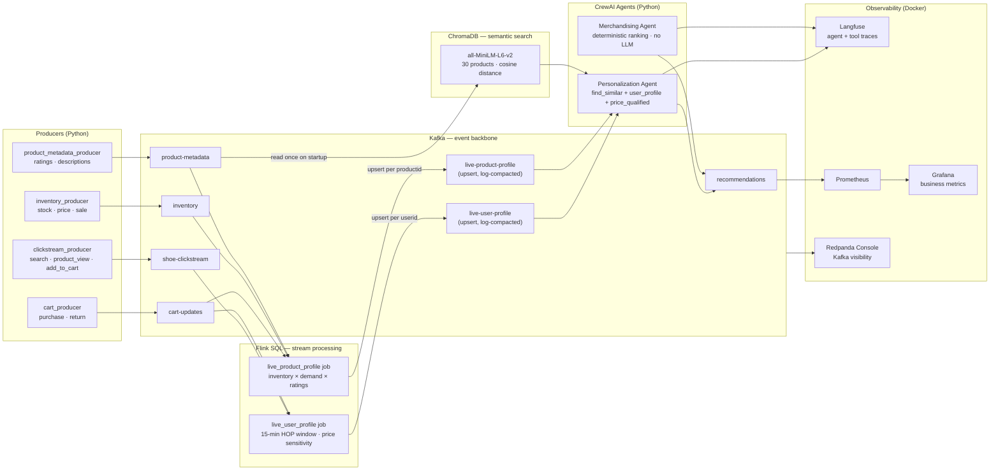

# Real-Time Shoe Personalization Engine

A learning platform for Kafka, Flink, vector search, and agentic AI. Simulates a shoe retailer where live user behavior becomes real-time recommendations in seconds — no batch jobs, no stale cache.

## What This Teaches

| Layer | Technology | Concept |
|---|---|---|
| Event ingestion | Kafka | Topics, partitions, producers, consumer groups, log compaction |
| Stream processing | Apache Flink SQL | Dynamic tables, HOP windows, watermarks, upsert sinks |
| Semantic search | ChromaDB + all-MiniLM-L6-v2 | Embeddings, cosine similarity, category pre-filtering |
| Agentic AI | CrewAI + OpenAI gpt-4o-mini | Tools, tasks, LLM reasoning loop, deterministic guardrails |
| Observability | Langfuse + Prometheus + Grafana | Agent traces, business metrics, live dashboards |

## Documentation

The README is your entry point. Each doc goes deeper:

| Doc | What it covers |
|---|---|
| [`docs/architecture.md`](docs/architecture.md) | Every component, data contracts, deployment topology, Docker services, Kafka topic schemas |
| [`docs/concepts-and-flows.md`](docs/concepts-and-flows.md) | Kafka internals, Flink SQL mechanics, vector search, CrewAI framework, end-to-end data flows with real examples |
| [`docs/agents.md`](docs/agents.md) | Personalization and merchandising agent logic, tools, task prompts, price-qualified filtering, observability tracing |
| [`docs/operations.md`](docs/operations.md) | Complete startup runbook, environment variables, health checks, debugging by layer |

## Architecture



## Quick Start

**Prerequisites:** Docker Desktop, Python 3.11, an OpenAI API key.

```bash
# 1. Clone and install dependencies
git clone https://github.com/AdvaitDarbare/realtime-personalization-engine.git
cd realtime-personalization-engine
python3.11 -m venv agents/venv
source agents/venv/bin/activate
pip install -r requirements.txt

# 2. Create .env with your credentials
cat > .env <<EOF
KAFKA_BOOTSTRAP_SERVERS=localhost:9092
AGENT_LLM_PROVIDER=openai
AGENT_LLM_MODEL=gpt-4o-mini
OPENAI_API_KEY=sk-...
LANGFUSE_PUBLIC_KEY=pk-lf-...
LANGFUSE_SECRET_KEY=sk-lf-...
LANGFUSE_HOST=http://localhost:3001
EOF

# 3. Start Docker infrastructure
cd docker && docker compose up -d && cd ..

# 4. Submit Flink SQL jobs
docker exec -it flink-jobmanager /opt/flink/bin/sql-client.sh -f /opt/flink/jobs/jobs.sql

# 5. Start data producers (separate terminals)
source agents/venv/bin/activate
python -u producers/clickstream_producer.py &
python -u producers/cart_producer.py &
python -u producers/inventory_producer.py &
python -u producers/product_metadata_producer.py &

# 6. Run the agent loop
cd agents && env $(cat ../.env | grep -v '^#' | xargs) venv/bin/python main.py
```

Open the observability surfaces:
- **Grafana** → `http://localhost:3000` (admin/admin) — business metrics
- **Langfuse** → `http://localhost:3001` — agent traces
- **Flink UI** → `http://localhost:8080` — streaming jobs
- **Redpanda Console** → `http://localhost:8088` — Kafka topics

## How One Recommendation Is Produced

```
user browses running shoes, adds to cart
        ↓ (clickstream + cart-updates → Kafka)
Flink computes: active_interest_category="running", price_sensitivity="high", avg_order_price=$72
        ↓ (upsert → live-user-profile)
Agent wakes up, reads user profile
        ↓
ChromaDB: find_similar("budget everyday running shoe active shopper", category="running")
        → NK-007 (0.513), NK-003 (0.517), NK-002 (0.494)
        ↓
get_price_qualified_products(sensitivity="high", avg=$72, category="running")
        → [NK-007 eff=$79.99] ← only qualifying running shoe ≤ $90
        ↓
LLM: cross-reference similarity + qualified → pick NK-007, explain why
        ↓ (→ recommendations topic)
"Product: Nike Free Run 5.0 (NK-007) | Price: $79.99 | Stock: 22 units"
```

## Component Summary

| Component | File(s) | Role |
|---|---|---|
| Clickstream producer | `producers/clickstream_producer.py` | Simulates user browsing: search, product_view, add_to_cart |
| Cart producer | `producers/cart_producer.py` | Simulates purchases and returns |
| Inventory producer | `producers/inventory_producer.py` | Simulates stock changes, price updates, sale toggles |
| Metadata producer | `producers/product_metadata_producer.py` | Simulates ratings, reviews, product descriptions |
| Flink SQL | `flink/jobs.sql` | 2 streaming jobs: live user profiles + live product profiles |
| Vector tools | `agents/tools/vector_tools.py` | ChromaDB index build + `find_similar_products` tool |
| Kafka tools | `agents/tools/kafka_tools.py` | All Kafka read/write tools + price-qualified filtering |
| Agent config | `agents/config/agents.py` | LLM config, agent definitions, tool assignment |
| Tasks | `agents/tasks/tasks.py` | Natural-language task prompts for each agent |
| Crew | `agents/crew.py` | CrewAI crew assembly, Langfuse trace context |
| Observability | `agents/observability.py` | Langfuse client, trace/span helpers |
| Agent loop | `agents/main.py` | Watches live-user-profile, triggers agents on new profiles |
| Metrics exporter | `monitoring/kafka_exporter.py` | Converts Kafka state to Prometheus metrics |
| Dashboard | `docker/grafana/dashboards/shoe-personalization.json` | Grafana provisioned dashboard |

## Key Design Decisions

**Merchandising is deterministic.** The ranking of products to promote (low stock + high demand + on sale) is computed in Python, not by the LLM. The LLM is reserved for decisions that require language and reasoning.

**Price filtering is code, not LLM arithmetic.** `Get Price Qualified Products` enforces price sensitivity tiers in Python before the LLM ever sees candidates. This prevents the model from recommending a $79.99 shoe to a medium-sensitivity user expecting $80–$120.

**Vector search uses cosine distance.** Sentence embeddings from `all-MiniLM-L6-v2` are unit vectors; cosine distance is the correct metric. L2 distance (the ChromaDB default) gives wrong rankings for normalized embeddings.

**Queries vary per user.** The task prompt instructs the agent to build a 4–8 word query using the user's `avg_order_price` and behavior signals (recent_searches, cart_adds), not just their category tier. This prevents identical queries from generating identical recommendations.
