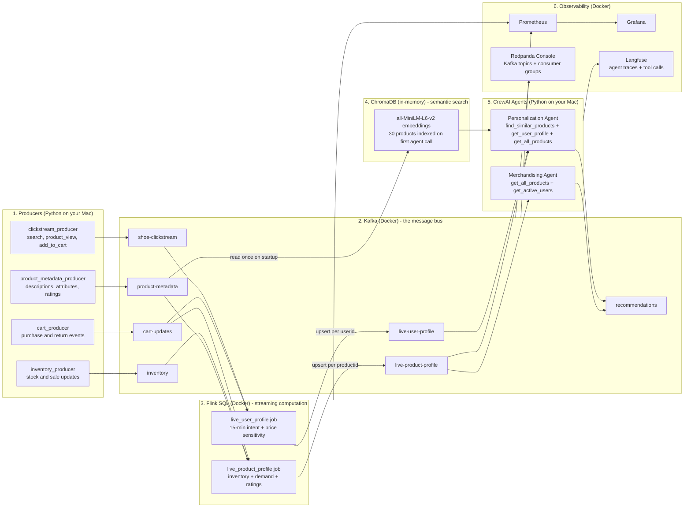
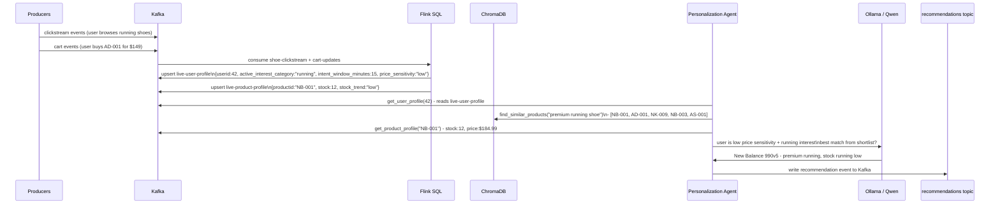
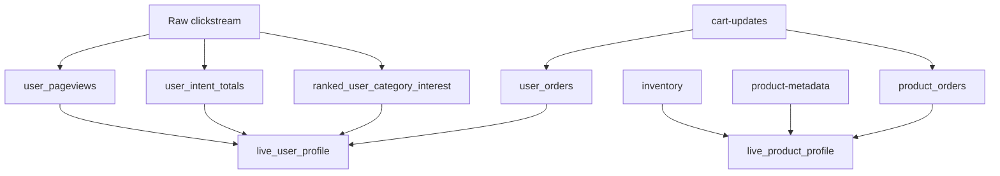

# Real-Time Shoe Personalization

This project is a learning lab for Kafka, Flink, stream processing, vector search, agentic workflows, and dashboarding. It simulates a shoe retailer where live user behavior and product signals are turned into real-time user and product profiles. Agents then use those profiles, plus semantic product search, to recommend products and merchandising actions.

The inspiration is the real-time personalization architecture from the reference diagram: instead of waiting for a nightly batch job, the system reacts to what a user is doing right now.

## Documentation Set

The README gives you the quick path through the project. The deeper learning docs live in `docs/`:

| Doc | What it explains |
| --- | --- |
| `docs/architecture.md` | System boundaries, topic contracts, deployment shape, and current limitations |
| `docs/concepts-and-flows.md` | Kafka, Flink, vector search, agents, monitoring, and end-to-end data flows |
| `docs/operations.md` | Local setup, run commands, health checks, and debugging by layer |

## What This Teaches

- **Kafka** as the event backbone: clickstream, cart, inventory, product metadata, profiles, and recommendations all flow through topics. Nothing talks directly to anything else.
- **Flink SQL** for continuous stream transformation: aggregations, multi-stream joins, and upsert sinks that maintain a live state per key.
- **Vector search** with ChromaDB: product descriptions and attributes are embedded into a local semantic model so agents can find products by meaning, not just category or price.
- **Agentic applications**: CrewAI agents use Kafka reads and vector search as tools, reason with an LLM, and write their output back to Kafka.
- **Grafana and Prometheus** for live business metrics, **Redpanda Console** for Kafka topic/consumer visibility, and **Langfuse** for agent/tool/vector traces.

## Architecture



## How One Recommendation Is Produced



## Main Components

### Producers

The producers are small Python programs that simulate live retail events.

- `producers/clickstream_producer.py`
  - Writes to `shoe-clickstream`.
  - Produces `search`, `product_view`, and `add_to_cart` events.
  - Gives Flink a live signal for active user intent.

- `producers/cart_producer.py`
  - Writes to `cart-updates`.
  - Produces `purchase` and `return` events.
  - Lets Flink infer order history and price sensitivity.

- `producers/inventory_producer.py`
  - Writes to `inventory`.
  - Produces stock, sale, brand, category, and price updates.
  - Lets Flink determine stock urgency.

- `producers/product_metadata_producer.py`
  - Writes to `product-metadata`.
  - Produces ratings and review count updates.
  - Adds external product context, similar to reviews/metadata in the reference architecture.

### Kafka

Kafka is the durable event log. This project uses these important topics:

| Topic | Role |
| --- | --- |
| `shoe-clickstream` | Raw user browsing and intent events |
| `cart-updates` | Purchase and return events |
| `inventory` | Product stock, sale, and price updates |
| `product-metadata` | Ratings/reviews metadata |
| `live-user-profile` | Flink upsert sink for current user state |
| `live-product-profile` | Flink upsert sink for current product state |
| `recommendations` | Agent output topic |

The important Kafka learning idea is that every subsystem communicates through topics. Producers do not call Flink or agents directly. They publish events, and downstream systems consume those events independently.

### Flink

`flink/jobs.sql` defines the streaming tables, views, and insert jobs.

The user profile job combines:

- Recent page views from a rolling 15-minute clickstream window.
- Recent searches and cart adds from the same rolling window.
- Active interest category from the most frequent category in the current 15-minute intent window.
- Order count, purchase count, return count, and average order price from cart events.
- Price sensitivity derived from average order price.

The product profile job combines:

- Inventory data.
- Cart demand.
- Ratings metadata.
- Stock trend derived from stock level.

Flink writes both outputs to Kafka using `upsert-kafka`, which means each user or product key keeps receiving a newer version of its live profile.



### Agents

The agents live in `agents/`.

| File | Role |
| --- | --- |
| `agents/tools/kafka_tools.py` | Kafka reads and writes as CrewAI tools |
| `agents/tools/vector_tools.py` | Semantic product search via ChromaDB |
| `agents/config/agents.py` | Agent definitions, LLM config, tool assignment |
| `agents/tasks/tasks.py` | Natural-language task descriptions |
| `agents/crew.py` | Crew assembly and kickoff |
| `agents/test.py` | Interactive one-shot test |
| `agents/main.py` | Continuous watcher - triggers agents from live profile updates |

**Personalization agent tools**:

1. `Find Similar Products` - queries ChromaDB with a semantic description of the user's intent (e.g. "cushioned running shoe"). Returns the 5 most relevant product IDs by meaning.
2. `Get Live User Profile` - reads from `live-user-profile` (Flink output). Returns recent intent-window behavior, price sensitivity, active interest category, and order history.
3. `Get Live Product Profile` - reads from `live-product-profile` (Flink output). Returns live stock, demand score, current price for a specific product.
4. `Get All Products` - returns all 30 live product profiles at once for broad comparisons.

The task prompt asks the agent to use vector search first, then verify live price and stock. Because the LLM is local and small, it may still choose a different tool order. That is useful to observe: tool availability does not guarantee tool discipline.

**Merchandising agent tools**:

1. `Get All Products` - scans all live product profiles for low-stock and high-demand signals.
2. `Get All Active Users` - returns users with at least one order.

Both agents write their output to the `recommendations` Kafka topic via `write_recommendation()`.

### Vector Search

`agents/tools/vector_tools.py` builds an in-memory ChromaDB collection on the first agent call of each process:

1. Reads all messages from the `product-metadata` Kafka topic.
2. Embeds each product as a sentence: `"{name}: {description}. Attributes: {attr1, attr2, ...}"`.
3. Uses ChromaDB's default local model (`all-MiniLM-L6-v2`). No API key is needed; it runs entirely on your machine. Model is downloaded once (~79MB) and cached at `~/.cache/chroma/`.
4. When the agent calls `find_similar_products("retro lifestyle sneaker")`, the query is embedded the same way and the 5 nearest products are returned by cosine similarity.

This means the agent discovers relevant products by *meaning* before checking live stock and price, rather than doing keyword matching or dumping all 30 products into the prompt.

### Local LLM

This project now uses Ollama with `qwen3.5:4b`.

Environment defaults:

```bash
export AGENT_LLM_PROVIDER="ollama"
export AGENT_LLM_MODEL="qwen3.5:4b"
export AGENT_LLM_BASE_URL="http://localhost:11434"
```

No cloud LLM API key is required for normal testing.

Small local models can be slow and occasionally ignore formatting instructions. In this project, the LLM should be treated as the explanation layer. The more deterministic the Python tools make candidate retrieval and ranking, the more reliable the final recommendation becomes.

### Monitoring And Grafana

The dashboard layer is now provisioned under `docker/grafana/`.

| File | Role |
| --- | --- |
| `docker/grafana/provisioning/datasources/prometheus.yaml` | Automatically registers Prometheus as Grafana's data source |
| `docker/grafana/provisioning/dashboards/dashboard.yaml` | Automatically loads dashboards from disk |
| `docker/grafana/dashboards/shoe-personalization.json` | Shoe personalization dashboard |
| `monitoring/kafka_exporter.py` | Reads Kafka topics and exposes business metrics for Prometheus |

Prometheus runs in Docker, but the exporter runs on your Mac because it needs to read local Kafka at `localhost:9092`.

Exporter metrics:

- `shoe_users_total{price_sensitivity=...}`
- `shoe_users_by_category{category=...}`
- `shoe_avg_order_price`
- `shoe_products_total`
- `shoe_products_low_stock`
- `shoe_products_on_sale`
- `shoe_product_demand_score{productid=...,name=...}`
- `shoe_product_stock{productid=...,name=...}`
- `shoe_recommendations_total{agent_type=...}`

## Running The Project

### 1. Start Docker services

Create a Python environment first if you do not already have one:

```bash
cd /Users/advaitdarbare/Desktop/shoe-personalization
python3.11 -m venv .venv
source .venv/bin/activate
pip install -r requirements.txt
```

```bash
cd /Users/advaitdarbare/Desktop/shoe-personalization/docker
docker compose up -d
```

Services:

- Kafka: `localhost:9092`
- Schema Registry: `http://localhost:8081`
- Kafka Connect: `http://localhost:8083`
- Flink UI: `http://localhost:8080`
- Grafana: `http://localhost:3000` with `admin` / `admin`
- Prometheus: `http://localhost:9090`

### 2. Start Flink SQL jobs

```bash
docker exec -it flink-jobmanager /opt/flink/bin/sql-client.sh -f /opt/flink/jobs/jobs.sql
```

Check jobs:

```bash
docker exec flink-jobmanager /opt/flink/bin/flink list
```

You should see:

- `insert-into_default_catalog.default_database.live_user_profile`
- `insert-into_default_catalog.default_database.live_product_profile`

### 3. Start producers

The producers use the agents venv (Python 3.11). In separate terminals:

```bash
cd /Users/advaitdarbare/Desktop/shoe-personalization/producers
source ../agents/venv/bin/activate
python -u clickstream_producer.py
```

```bash
cd /Users/advaitdarbare/Desktop/shoe-personalization/producers
source ../agents/venv/bin/activate
python -u cart_producer.py
```

```bash
cd /Users/advaitdarbare/Desktop/shoe-personalization/producers
source ../agents/venv/bin/activate
python -u inventory_producer.py
```

```bash
cd /Users/advaitdarbare/Desktop/shoe-personalization/producers
source ../agents/venv/bin/activate
python -u product_metadata_producer.py
```

### 4. Start the Prometheus business metrics exporter

```bash
cd /Users/advaitdarbare/Desktop/shoe-personalization
source agents/venv/bin/activate
python monitoring/kafka_exporter.py
```

The exporter serves metrics at:

```text
http://localhost:8888/metrics
```

Prometheus is configured to scrape this via `host.docker.internal:8888`.

### 5. Open Grafana

Open:

```text
http://localhost:3000
```

Login:

```text
username: admin
password: admin
```

The `Shoe Personalization` dashboard should be provisioned automatically from `docker/grafana/dashboards/shoe-personalization.json`.

### 6. Run the smoke test

```bash
cd /Users/advaitdarbare/Desktop/shoe-personalization/agents
./venv/bin/python smoke_test.py
```

The smoke test checks:

- Docker services are running.
- Flink jobs are running.
- Kafka topics exist.
- Kafka source and sink topics have messages.
- Live user/product profile records have the expected fields.
- Ollama has `qwen3.5:4b` installed.

If the smoke test says Flink jobs are missing but Kafka profile topics still contain data, the agents may still return recommendations from old profile records. For true live behavior, restart the Flink containers and resubmit `flink/jobs.sql`.

```bash
cd /Users/advaitdarbare/Desktop/shoe-personalization/docker
docker compose up -d flink-jobmanager flink-taskmanager
docker exec -it flink-jobmanager /opt/flink/bin/sql-client.sh -f /opt/flink/jobs/jobs.sql
```

### 7. Run an agent manually

```bash
cd /Users/advaitdarbare/Desktop/shoe-personalization/agents
./venv/bin/python test.py
```

Pick:

- `1` for one personalization recommendation.
- `2` for merchandising recommendations.
- `3` for both agents.

Use a user id from `1` to `100`. If the pipeline has been running for a minute, all users should eventually have live profiles.

### 8. Run continuous agent mode

```bash
cd /Users/advaitdarbare/Desktop/shoe-personalization/agents
./venv/bin/python main.py
```

This watches `live-user-profile` and triggers agents when profiles update. For learning, start with `test.py` first because it is easier to reason about one request at a time.

## Useful Debug Commands

List Kafka topics:

```bash
docker exec kafka kafka-topics --bootstrap-server localhost:9092 --list
```

Check topic offsets:

```bash
docker exec kafka kafka-get-offsets --bootstrap-server localhost:9092 --topic live-user-profile
```

Inspect a topic:

```bash
docker exec kafka kafka-console-consumer \
  --bootstrap-server localhost:9092 \
  --topic live-user-profile \
  --from-beginning \
  --max-messages 5
```

Check Flink jobs:

```bash
docker exec flink-jobmanager /opt/flink/bin/flink list
```

Check Ollama:

```bash
ollama list
curl -s http://localhost:11434/api/generate \
  -d '{"model":"qwen3.5:4b","prompt":"Reply with ok","stream":false}'
```

Check the exporter:

```bash
curl -s http://localhost:8888/metrics | grep '^shoe_'
```

Check Grafana provisioning:

```bash
docker logs grafana | grep -i dashboard
```

## How To Think About The Learning Path

### Kafka concepts

- Topic: named stream of events.
- Producer: writes events to a topic.
- Consumer: reads events from a topic.
- Offset: position in a topic partition.
- Consumer group: lets multiple consumers share work.
- Key: determines event partitioning and enables upsert behavior.

### Flink concepts

- Source table: Kafka topic treated as a dynamic table.
- View: reusable streaming query.
- Continuous aggregation: query updates forever as events arrive.
- Upsert sink: output stream where records with the same key replace older records.
- Event time: clickstream uses the producer `ts` field plus a watermark so intent is based on when the event happened.
- Rolling window: user intent is recomputed from a 15-minute hopping window, so active interest follows recent behavior.

### Agent concepts

- Tool: function an agent can call to fetch live context or write output.
- Task: natural-language instruction that tells the agent what to do.
- Agent: role + goal + tools + LLM.
- Recommendation loop: read context, reason, write result.
- Guardrail: deterministic code should do strict filtering and ranking where correctness matters; the LLM should explain the selected result.

## Current Status

Working:

- Kafka event ingestion from all four producers.
- Flink live user profile job (15-minute intent window, active category, price sensitivity).
- Flink live product profile job (stock trend, demand score, ratings).
- Semantic vector search via ChromaDB with local `all-MiniLM-L6-v2` embeddings.
- Personalization agent: semantic search -> live profile lookup -> Ollama/Qwen recommendation.
- Merchandising agent: full product scan -> Ollama/Qwen promotion recommendations.
- Recommendation output written back to Kafka `recommendations` topic.
- Prometheus business metrics exporter.
- Grafana dashboard provisioning.

Good next improvements:

- Move recommendation candidate filtering/ranking into deterministic Python code, then ask the LLM to explain the chosen product.
- Add a small FastAPI service for agent calls instead of only CLI scripts.
- Add deterministic producer seed modes for repeatable demos.
- Add unit tests for producer event schemas and tool output shaping.

## Mapping Back To The Inspiration

The uploaded architecture described this pattern:

1. Clickstream, cart, and inventory events stream into Kafka.
2. Flink transforms raw events into intent and profile features.
3. Product metadata joins enrich the stream.
4. A live context engine stores current user/product profiles.
5. Agents retrieve the live context and produce recommendations.
6. Dashboards observe the system.

This project implements the same shape with a shoe domain:

- Kafka is the real-time event bus.
- Flink is the real-time context engine.
- `live-user-profile` and `live-product-profile` are the live profile stores.
- CrewAI + Ollama are the agentic recommendation layer.
- Grafana/Prometheus are the observability layer.
