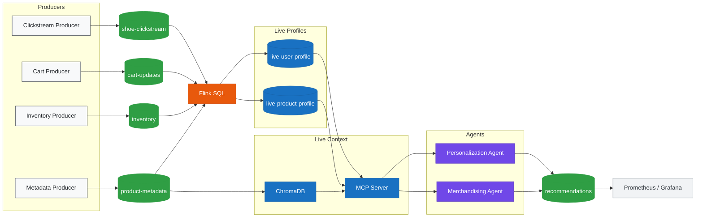

# Real-Time Shoe Personalization

A small learning project that shows how Kafka, Flink, and CrewAI can work together in an end-to-end streaming data pipeline.

The project simulates a shoe store. Python producers send live clickstream, cart, inventory, and product metadata events into Kafka. Flink SQL turns those raw events into live user and product profiles. CrewAI agents read that context through MCP tools, search a small product index, apply simple price guardrails, and write recommendations back to Kafka.

This is intentionally not a production platform. It is a practical demo for learning how a real-time AI context layer might work.

## Inspiration

The reference architecture picture describes this pattern:

1. User and business events stream into Kafka.
2. Flink transforms those events into live intent features.
3. Metadata enriches the context.
4. A real-time context engine stores current user and product state.
5. Agents read that context and produce recommendations.

This repo keeps that same shape, but narrows the domain to shoes so the project stays approachable.

| Architecture picture | This project |
| --- | --- |
| Clickstream, cart, inventory events | Python producer scripts |
| Kafka stream | Local Kafka broker in Docker |
| Flink feature jobs | `flink/jobs.sql` |
| External metadata and embeddings | `product-metadata` topic plus ChromaDB |
| Live user/product context | `live-user-profile` and `live-product-profile` Kafka topics |
| Personalization agent | CrewAI agent in `agents/` |

## Architecture

The diagram below is intentionally close to the reference picture, but scoped to this learning project.



The diagram is kept in the README as Mermaid so it renders directly on GitHub.

## What Each Layer Does

**Kafka** is the event backbone. The producers do not call Flink or the agent directly. They only write facts to topics like `shoe-clickstream`, `cart-updates`, `inventory`, and `product-metadata`.

**Flink** is the streaming feature builder. It reads those raw topics and continuously updates two compact context topics:

- `live-user-profile`: recent searches, cart adds, active category, order history, average order price, and price sensitivity
- `live-product-profile`: stock, sale status, demand score, rating, and category

**ChromaDB** is a tiny local semantic product index. It reads product metadata from Kafka and lets the agent search for products using text like `budget everyday running shoe`.

**MCP** is the context serving layer between live profiles and agents. `agents/mcp_server.py` exposes the live Kafka profiles and ChromaDB search through named tools (`get_live_user_profile`, `get_price_qualified_catalog`, `search_similar_products`, `get_live_product_catalog`). Agents call these tools through CrewAI's `MCPServerAdapter` and never touch Kafka or ChromaDB directly.

**CrewAI** is the AI layer. The personalization agent calls MCP tools to read live user context, search similar products, and filter by price sensitivity, then produces one recommendation.

## Repository Structure

```text
.
|-- agents/
|   |-- main.py                  # Watches live user profiles and triggers recommendations
|   |-- crew.py                  # CrewAI runner functions
|   |-- mcp_server.py            # MCP server — primary context layer for agents
|   |-- smoke_test.py            # Local health check script
|   |-- config/agents.py         # OpenAI LLM and agent definitions
|   |-- tasks/tasks.py           # CrewAI task prompts
|   `-- tools/                   # Kafka and vector-search tools
|-- docker/docker-compose.yml    # Kafka, topic init, Redpanda Console, Flink
|-- flink/jobs.sql               # Streaming SQL jobs
|-- monitoring/kafka_exporter.py # Optional Grafana/Prometheus metrics exporter
|-- producers/                   # Event generators
|-- .env.example
|-- requirements.txt
`-- README.md
```

## Prerequisites

- Docker Desktop
- Python 3.11+
- An OpenAI API key

## Environment Variables

Create a `.env` file in the repo root:

```bash
cp .env.example .env
```

Then edit it:

```bash
KAFKA_BOOTSTRAP_SERVERS=localhost:9092
AGENT_LLM_MODEL=gpt-4o-mini
OPENAI_API_KEY=sk-your-key
```

`AGENT_LLM_MODEL` is optional. It defaults to `gpt-4o-mini`.

The Python scripts load this `.env` file automatically.

## Run Locally

### 1. Install Python Dependencies

```bash
python3.11 -m venv .venv
source .venv/bin/activate
pip install -r requirements.txt
```

### 2. Start Kafka and Flink

```bash
cd docker
docker compose up -d
cd ..
```

Check the containers:

```bash
docker compose -f docker/docker-compose.yml ps
```

Expected core services:

- `kafka`
- `redpanda-console`
- `flink-jobmanager`
- `flink-taskmanager`

Expected dashboard services:

- `kafka-exporter`
- `prometheus`
- `grafana`

`kafka-init` should exit successfully after creating the topics.

### 3. Submit the Flink SQL Jobs

```bash
docker exec -it flink-jobmanager /opt/flink/bin/sql-client.sh -f /opt/flink/jobs/jobs.sql
```

Verify the jobs:

```bash
docker exec flink-jobmanager /opt/flink/bin/flink list
```

You should see jobs for `live_user_profile` and `live_product_profile`.

### 4. Start the Event Producers

Run these in separate terminals, or run them in the background while learning:

```bash
source .venv/bin/activate
python -u producers/inventory_producer.py
python -u producers/product_metadata_producer.py
python -u producers/clickstream_producer.py
python -u producers/cart_producer.py
```

If you run them in the background:

```bash
source .venv/bin/activate
python -u producers/inventory_producer.py &
python -u producers/product_metadata_producer.py &
python -u producers/clickstream_producer.py &
python -u producers/cart_producer.py &
```

Check Kafka offsets:

```bash
docker exec kafka kafka-get-offsets --bootstrap-server localhost:9092 --topic shoe-clickstream
docker exec kafka kafka-get-offsets --bootstrap-server localhost:9092 --topic live-user-profile
docker exec kafka kafka-get-offsets --bootstrap-server localhost:9092 --topic live-product-profile
```

Offsets greater than `0` mean data is flowing.

### 5. Run the CrewAI Agent

```bash
source .venv/bin/activate
python agents/main.py
```

The agent waits for valid live user profiles. Once Flink has processed enough clickstream and cart events, you should see output like:

```text
Triggering Personalization Agent for user 42
Profile: orders=3, sensitivity=medium

Recommendation for user 42:
Product: Nike Pegasus 40 (NK-002)
Price: $119.99
Live signal: running interest from recent browsing and cart activity
Why this user: medium price sensitivity matches their average order price
Stock: 37 units, medium trend
```

The recommendation is also written to the `recommendations` Kafka topic.

### 6. Optional: Run the MCP Context Server

This is a thin access layer over the same Kafka/Flink context used by CrewAI. It keeps the project aligned with the reference diagram without adding another database or service.

For local MCP clients that launch a server over stdio:

```bash
source .venv/bin/activate
python agents/mcp_server.py
```

Available MCP tools:

- `get_live_user_profile(userid)`
- `get_live_product_profile(productid)`
- `get_live_product_catalog()`
- `get_price_qualified_catalog(price_sensitivity, avg_order_price, category)`
- `search_similar_products(query, category)`
- `publish_recommendation(userid, recommendation, agent_type)`

For experimentation over HTTP:

```bash
source .venv/bin/activate
python agents/mcp_server.py --transport streamable-http --port 8000
```

## Useful Local URLs

- Flink UI: [http://localhost:8080](http://localhost:8080)
- Redpanda Console: [http://localhost:8088](http://localhost:8088)
- Grafana dashboard: [http://localhost:3000/d/shoe-personalization/shoe-personalization-learning-dashboard](http://localhost:3000/d/shoe-personalization/shoe-personalization-learning-dashboard) (`admin` / `admin`)
- Prometheus: [http://localhost:9090](http://localhost:9090)

## Smoke Test

After the stack, producers, and Flink jobs are running:

```bash
source .venv/bin/activate
python agents/smoke_test.py
```

The smoke test checks:

- Docker services are running
- Kafka topics exist and have messages
- Flink profile jobs are running
- Live user and product profiles exist
- OpenAI configuration is present

## Troubleshooting

**Flink jobs are running but profile topics are empty**

Submit the Flink jobs before starting or restarting the producers. The SQL sources use `latest-offset`, so Flink only processes new events.

**The agent says no user profile was found**

Let the clickstream and cart producers run for a minute or two. The agent only triggers after Flink has enough data to create a profile with a known price sensitivity.

**The vector index is empty**

Run `product_metadata_producer.py` before the agent. The ChromaDB index is built lazily on the first semantic search.

**OpenAI errors**

Check that `.env` exists and includes `OPENAI_API_KEY`. You can also export it directly:

```bash
export OPENAI_API_KEY=sk-your-key
```

**Kafka connection refused**

Make sure Docker is running and Kafka is healthy:

```bash
docker compose -f docker/docker-compose.yml ps
docker logs kafka --tail 50
```
