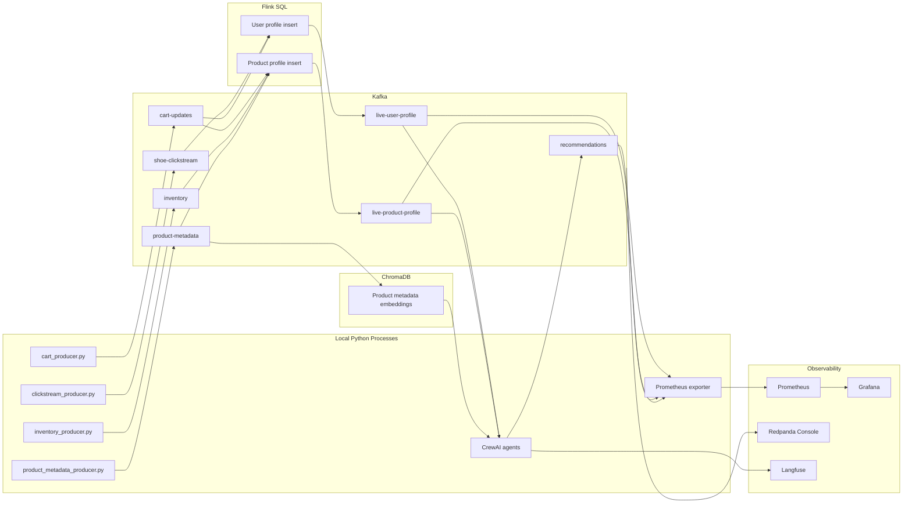

# Architecture Deep Dive

This project is a miniature real-time personalization platform. It uses the same shape as many production data systems: raw events are published to Kafka, stream processors maintain live features, agent code reads those features, and monitoring turns system state into dashboards.

The domain is a shoe store, but the architecture generalizes to fintech fraud scoring, food delivery dispatch, ads ranking, gaming telemetry, and any system where the answer should change as new events arrive.

## System Map



## Responsibility Boundaries

The producers own event creation. They simulate independent systems that would exist in a real retailer: web analytics, cart/order service, inventory service, and product catalog/reviews. They do not know who consumes their events.

Kafka owns transport and durability. It is the contract between systems. A producer writes an event once, and Flink, agents, exporters, or debugging consumers can read it independently.

Flink owns live feature computation. It turns many raw events into a smaller set of continuously updated user and product profiles. These profiles are the data product consumed by the agent layer.

ChromaDB owns semantic retrieval. It indexes product descriptions and attributes so the agent can ask for meaning, such as "stable cushioned running shoe", instead of only filtering exact columns.

The agents own decision and explanation. They fetch the current profile state, use vector search to form candidates, ask the local LLM to reason over those candidates, and write the result back to Kafka.

Prometheus and Grafana own live business visibility. The exporter reads Kafka and converts business state into time-series metrics that can be graphed.

Redpanda Console owns Kafka visibility. It lets you inspect topics, message payloads, partitions, offsets, and consumer groups without dropping into CLI commands.

Langfuse owns agentic visibility. Agent runs emit traces for profile lookups, vector retrieval, product profile checks, final answers, and recommendation writes when Langfuse credentials are configured.

## Observability Surfaces

| Surface | URL | What it answers |
| --- | --- | --- |
| Grafana | `http://localhost:3000` | Are business signals changing live? |
| Prometheus | `http://localhost:9090` | What metrics is the exporter exposing? |
| Flink UI | `http://localhost:8080` | Are streaming jobs running and processing records? |
| Redpanda Console | `http://localhost:8088` | What is in Kafka topics, and are consumers keeping up? |
| Langfuse | `http://localhost:3001` | What did the agent do during a recommendation run? |

## Topic Contracts

| Topic | Producer | Consumer | Key | Meaning |
| --- | --- | --- | --- | --- |
| `shoe-clickstream` | `clickstream_producer.py` | Flink | `userid` | User browsing/search/add-to-cart intent |
| `cart-updates` | `cart_producer.py` | Flink | `userid` | Purchases and returns |
| `inventory` | `inventory_producer.py` | Flink | `productid` | Product catalog, pricing, stock, sale state |
| `product-metadata` | `product_metadata_producer.py` | Flink, ChromaDB builder | `productid` | Ratings, review counts, semantic text fields |
| `live-user-profile` | Flink | Agents, exporter | `userid` | Current user feature row |
| `live-product-profile` | Flink | Agents, exporter | `productid` | Current product feature row |
| `recommendations` | Agents | Exporter, debug consumers | `userid` | Agent decisions and explanations |

## Why Upsert Topics Matter

Raw event topics append facts forever: user 42 viewed product A, then searched running shoes, then bought product B. A profile topic is different. It represents the latest known state for a key.

`live-user-profile` is keyed by `userid`. Every new profile row for user 42 supersedes the previous row for user 42. Kafka still stores the event log, but consumers can interpret it as a changing table. This is why Flink uses the `upsert-kafka` connector for the profile outputs.

## Event Time And Rolling Intent

The clickstream table uses event time from the producer `ts` field:

```sql
event_time AS TO_TIMESTAMP_LTZ(ts, 3),
WATERMARK FOR event_time AS event_time - INTERVAL '5' SECOND
```

Flink then computes user intent from a 15-minute hopping window that advances every minute. That means `active_interest_category`, `recent_page_views`, `recent_searches`, and `recent_cart_adds` describe what the user has been doing recently, not their all-time behavior.

Purchase history remains cumulative because price sensitivity is a longer-lived user trait. This split is intentional: the profile combines stable commercial history with live session intent.

## Deployment Shape

Docker runs infrastructure: Kafka, Schema Registry, Kafka Connect, Flink, Prometheus, and Grafana. Python scripts run on your Mac and connect to Kafka at `localhost:9092`.

Inside Docker, services talk to Kafka as `kafka:29092`. Outside Docker, local Python talks to Kafka as `localhost:9092`. This split is why the Kafka container advertises both listener addresses.

## Current Limitations

The clickstream intent window is processing recent behavior, but it is still a simple 15-minute count-based feature. Production systems might add session boundaries, decayed scores, device context, or learned intent models.

The vector index is in memory and rebuilt on first agent call in each process. That is useful for learning, but production systems normally persist embeddings and update them incrementally.

The LLM is used for recommendation wording and reasoning. Stronger reliability would come from deterministic Python ranking first, with the LLM explaining a chosen product rather than choosing from a broad set.
