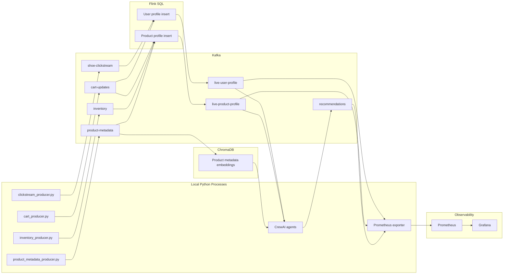

# Architecture Deep Dive

This project is a miniature real-time personalization platform. It uses the same shape as many production data systems: raw events are published to Kafka, stream processors maintain live features, agent code reads those features, and monitoring turns system state into dashboards.

The domain is a shoe store, but the architecture generalizes to fintech fraud scoring, food delivery dispatch, ads ranking, gaming telemetry, and any system where the answer should change as new events arrive.

## System Map

## Responsibility Boundaries

The producers own event creation. They simulate independent systems that would exist in a real retailer: web analytics, cart/order service, inventory service, and product catalog/reviews. They do not know who consumes their events.

Kafka owns transport and durability. It is the contract between systems. A producer writes an event once, and Flink, agents, exporters, or debugging consumers can read it independently.

Flink owns live feature computation. It turns many raw events into a smaller set of continuously updated user and product profiles. These profiles are the data product consumed by the agent layer.

ChromaDB owns semantic retrieval. It indexes product descriptions and attributes so the agent can ask for meaning, such as "stable cushioned running shoe", instead of only filtering exact columns.

The agents own decision and explanation. They fetch the current profile state, use vector search to form candidates, ask the local LLM to reason over those candidates, and write the result back to Kafka.

Prometheus and Grafana own visibility. The exporter reads Kafka and converts business state into time-series metrics that can be graphed.

## Topic Contracts

| Topic | Producer | Consumer | Key | Meaning |
| --- | --- | --- | --- | --- |
| `shoe-clickstream` | `clickstream_producer.py` | Flink | `userid` | User browsing/search/add-to-cart intent |
| `cart-updates` | `cart_producer.py` | Flink | `userid` | Purchases and returns |
| `inventory` | `inventory_producer.py` | Flink | `productid` | Product catalog, pricing, stock, sale state |
| `product-metadata` | `product_metadata_producer.py` | Flink, ChromaDB builder | `productid` | Ratings, review counts, semantic text fields |
| `live-user-profile` | Flink | Agents, exporter | `userid` | Current user feature row |
| `live-product-profile` | Flink | Agents, exporter | `productid` | Current product feature row |
| `recommendations` | Agents | Exporter, debug consumers | `userid` | Agent decisions and explanations |

## Why Upsert Topics Matter

Raw event topics append facts forever: user 42 viewed product A, then searched running shoes, then bought product B. A profile topic is different. It represents the latest known state for a key.

`live-user-profile` is keyed by `userid`. Every new profile row for user 42 supersedes the previous row for user 42. Kafka still stores the event log, but consumers can interpret it as a changing table. This is why Flink uses the `upsert-kafka` connector for the profile outputs.

## Processing Time

The Flink SQL uses `PROCTIME()`, which means records are processed according to the time they reach Flink, not the original event timestamp in the payload. That keeps the learning project simple.

Production systems often use event time and watermarks because events can arrive late or out of order. A future version of this project could define event-time columns from `ts` and then build rolling one-hour windows for active intent.

## Deployment Shape

Docker runs infrastructure: Kafka, Schema Registry, Kafka Connect, Flink, Prometheus, and Grafana. Python scripts run on your Mac and connect to Kafka at `localhost:9092`.

Inside Docker, services talk to Kafka as `kafka:29092`. Outside Docker, local Python talks to Kafka as `localhost:9092`. This split is why the Kafka container advertises both listener addresses.

## Current Limitations

The live profiles are all-time aggregations, not recent rolling windows. The word "active" in `active_interest_category` means "most observed category so far" in the current SQL.

The vector index is in memory and rebuilt on first agent call in each process. That is useful for learning, but production systems normally persist embeddings and update them incrementally.

The LLM is used for recommendation wording and reasoning. Stronger reliability would come from deterministic Python ranking first, with the LLM explaining a chosen product rather than choosing from a broad set.
