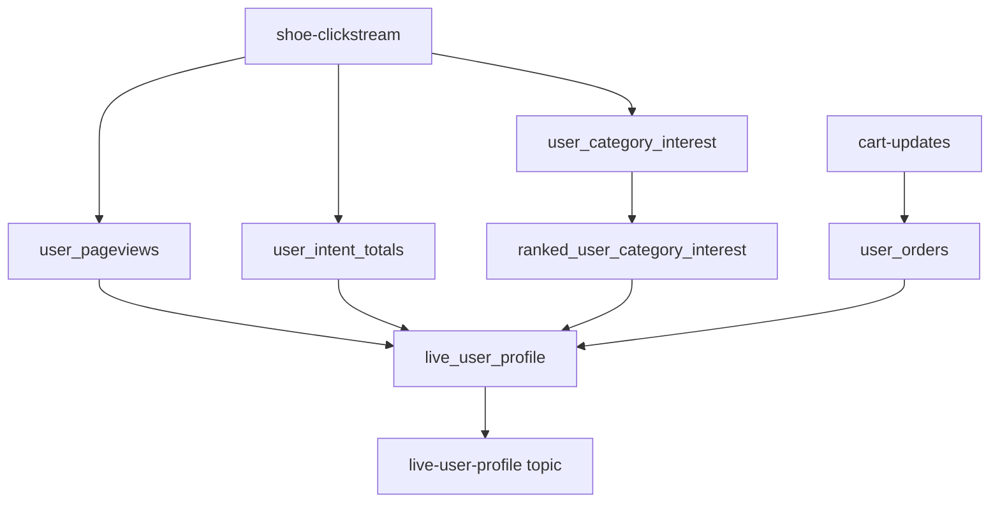
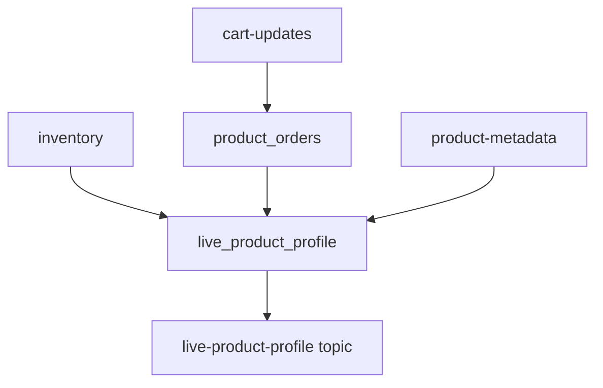
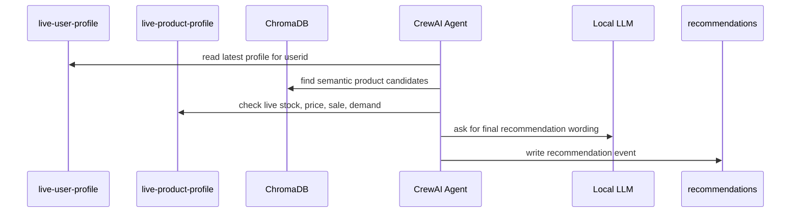

# Concepts And Flows

This guide explains the data engineering ideas behind the project. Read it as a companion to the code: the files show how things work, and this doc explains why the pieces exist.

## Event-Driven Thinking

A batch system asks, "What changed since yesterday?" A streaming system asks, "What changed just now?"

In this project, every user action or product update becomes an event. An event is an immutable fact:

```json
{
  "userid": 42,
  "event_type": "product_view",
  "productid": "NB-003",
  "category": "running",
  "ts": 1760000000000
}
```

The event should not say what recommendation to make. It should only describe what happened. Downstream systems can then interpret the same event for multiple purposes: personalization, inventory planning, metrics, debugging, or training data.

## Kafka: The Event Log

Kafka stores events in topics. A topic is like an append-only table, except it is optimized for ordered reads and writes. Producers append messages. Consumers remember offsets, which are positions in a topic partition.

The key controls partitioning and state. User events use `userid` because user-profile computations need all events for the same user to be grouped logically. Product events use `productid` because product-profile computations update one product at a time.

Consumer groups let multiple instances of the same application share topic partitions. Separate applications should use separate group ids so they can read the same data independently.

## Flink: Dynamic Tables

Flink SQL lets you treat Kafka topics as tables that never stop changing. A `CREATE TABLE` statement maps a Kafka topic to columns. A `CREATE VIEW` statement defines reusable transformations. An `INSERT INTO` statement starts a continuous job.

The key mental model is this:

Raw Kafka topic = stream of events.

Flink table = continuously changing table view over that stream.

Upsert Kafka sink = changelog of the latest rows by primary key.

## User Profile Flow



The profile combines behavioral intent and purchase history.

Page views measure browsing volume. Searches and cart adds measure stronger intent. Category counts infer what the user is currently interested in. Cart events infer order count, purchase count, return count, average order price, and price sensitivity.

Price sensitivity is intentionally simple:

| Average order price | `price_sensitivity` | Interpretation |
| --- | --- | --- |
| Less than 80 | `high` | Budget-conscious |
| 80 to 119.99 | `medium` | Moderate spender |
| 120 or more | `low` | Less price-sensitive, premium-friendly |

That naming can feel backwards at first: `high` means high sensitivity to price, not high spending.

## Product Profile Flow



The product profile combines current product state and demand.

Inventory provides name, brand, category, price, sale price, sale status, and stock. Cart events provide demand volume. Product metadata provides rating and review context.

`stock_trend` is a simple rule:

| Stock | `stock_trend` |
| --- | --- |
| Less than 20 | `low` |
| 20 to 49 | `medium` |
| 50 or more | `high` |

`demand_score` is currently `total_orders / 100.0`. It is a toy score, but it shows the pattern: raw order counts become a normalized feature for downstream consumers.

## Vector Search Flow

Vector search solves a different kind of lookup. A SQL filter can find `category = 'running'`, but it cannot understand that "plush long distance trainer" is close to "cushioned running shoe" unless those words appear exactly.

The ChromaDB tool builds an embedding for each product from name, description, and attributes. An embedding is a numeric representation of meaning. Similar meanings land near each other in vector space.

At recommendation time:

1. The agent sees the user's active category and behavior.
2. It creates a query like "cushioned daily running shoe".
3. ChromaDB returns the nearest products by semantic similarity.
4. The agent checks live stock and price from Kafka/Flink before recommending.

This is a useful pattern in data engineering plus AI systems: use structured features for correctness, and vector retrieval for semantic discovery.

## Agent Flow



The LLM should not be treated as the database. It is the reasoning and language layer. The tools provide facts. This distinction matters: data systems are reliable when factual retrieval is deterministic and explainable.

## Observability Flow

Prometheus does not read Kafka directly here. The project includes `monitoring/kafka_exporter.py`, which reads profile topics and exposes metrics at `http://localhost:8888/metrics`.

Prometheus scrapes the exporter. Grafana queries Prometheus. This three-step flow is common:

1. Application-specific exporter converts domain state into metrics.
2. Prometheus stores time-series samples.
3. Grafana visualizes those samples.

## Learning Exercises

Add event-time processing to Flink using the `ts` field and watermarks.

Change `active_interest_category` from all-time counts to a rolling one-hour window.

Build deterministic recommendation ranking in Python before invoking the LLM.

Persist ChromaDB to disk so embeddings do not rebuild every process.

Add schema validation for every producer event using Pydantic.

Add a small API service that exposes `/recommendation/{userid}` and calls the existing crew code.
